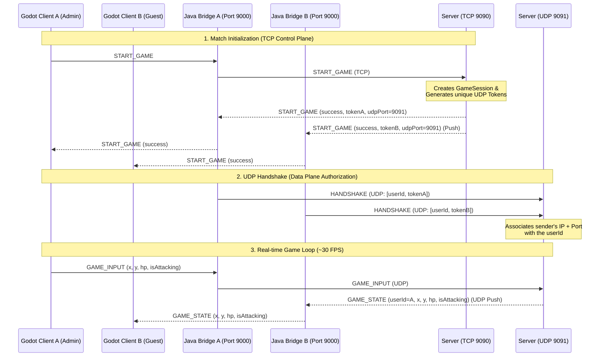

# Fight the Bebra 🎮

A cooperative 2D Pixel Top-Down online game for two players. The project features a custom client-server architecture designed for fast real-time synchronization, secure authentication, and lobby management.

---

## 🛠️ Tech Stack & Architecture

The project is split into three main components:
1.  **Frontend (Client):** **Godot 4** (GDScript) — handles the game loop, 2D rendering, pixel-art UI, local state interpolation, and sound effects.
2.  **Client Backend (Java Bridge):** A local Java proxy running on port `9000` that connects the Godot Client (via a raw `StreamPeerTCP` connection) to the main Game Server. It routes Control Plane requests over TCP and Data Plane gameplay packets over UDP.
3.  **Game Server (Backend):** **Java** — multithreaded server managing:
    *   **TCP Control Plane (Port 9090):** Handles registration, login, lobby creation, match lifecycle, and text chat.
    *   **UDP Data Plane (Port 9091):** Handles real-time gameplay input broadcasting at ~30 FPS.
    *   **Database:** SQLite — persists player authentication and personal record scores.

---

## 🌐 Networking Architecture

The network communication is structured around two channels to balance reliability and performance:



---

## 🎮 Key Features & Gameplay Logic

*   **Private Lobby Rooms:** Create or join private rooms using unique server-generated codes. Lobbies display the room record score.
*   **Lobby Chat:** Live text communication in the lobby scene with history isolation upon entry.
*   **Connection Status Monitor:** Real-time visibility of local Java Bridge connection status and main Game Server status (TCP & UDP connection indicators).
*   **Level timer & Survival Score:**
    *   Once a game begins, a 60-second level timer starts.
    *   Players receive **+100 points** for each second they survive.
    *   **Score** is updated live in the HUD.
*   **Records Persistence:**
    *   When the timer expires, the lobby Admin submits session results over TCP.
    *   The server saves new personal records to the SQLite database.
    *   The lobby accumulates the sum of all scores achieved across game sessions played in this room.
    *   Players are returned to the room view automatically with updated score records.

---

## 🚀 Getting Started

### 1. Prerequisite
*   **Java Development Kit (JDK) 21** or higher.
*   **Godot Engine 4** (compatible with GL Compatibility renderer).

### 2. Running the Server
Navigate to the `/server` folder and run the main entry point:
```bash
cd server
# If maven wrapper or mvn is installed globally:
mvn clean compile
java -cp target/classes dev.contentseeker10.ServerApp
```
*Creates a `database.db` SQLite database file in the server directory.*

### 3. Running the Client Backend (Java Bridge)
Navigate to the `/client-backend` folder and run the bridge:
```bash
cd client-backend
mvn clean compile
java -cp target/classes dev.contentseeker10.BridgeApp
```
*Listens on local port `9000` to bridge Godot packets to the server.*

### 4. Running the Game (Godot Client)
1. Open the `/client` directory in **Godot Engine 4**.
2. Run the project from the editor or export it to your target platform.
3. Sign up or log in to start playing!